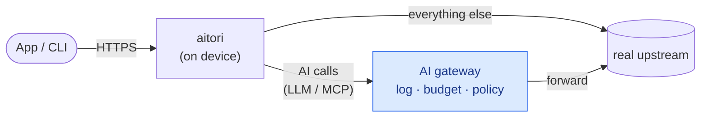

# aitori

aitori is a small agent that runs on a machine and intercepts the AI traffic
leaving it. Model and MCP calls from apps and command-line tools are sent through
a gateway, where they can be logged and checked against a policy; everything else
is left alone. The application is unaffected: it talks to the same endpoint, uses
the same key, and gets the same response back.

## Why

Many apps give you no way to change where they send their requests. A browser on
claude.ai or chatgpt.com has no setting that points it at a gateway.
The only place left to intercept that traffic is on the machine itself, before it
leaves. aitori decrypts only the hosts you list and leaves the rest alone, and if
the gateway is unavailable the request still reaches its original destination.

## How it works



A request to one of the listed hosts is decrypted and inspected. If it is a model
or MCP call, aitori forwards it to the gateway, which records it and passes it on
to the original destination. Anything else goes straight there. How requests are
classified, the block action, and how responses travel back are described in
[docs/architecture.md](docs/architecture.md).

## Quick start

Install the binary (macOS/Linux):

```bash
curl -fsSL https://raw.githubusercontent.com/truefoundry/aitori/main/install.sh | sh
```

To remove aitori later, see [Uninstall](docs/getting-started.md#1-install) (revert
system changes with `sudo aitori down` and `sudo aitori ca remove` before deleting
the binaries).

Then govern this machine and watch the traffic live — no gateway, no config:

```bash
sudo aitori up --ui
```

This installs a per-device CA and points the system at aitori. The built-in
profiles already cover Claude (Code, Desktop, web) and ChatGPT, so their calls are
decrypted, classified, and — with no gateway configured — passed straight through
to their real upstream (nothing breaks). Open the live view:

```
http://127.0.0.1:9100
```


Use Claude or ChatGPT, and the calls stream in:


**When you're done, clean up:**

```bash
sudo aitori down          # reverts the system proxy + undoes settings injection
```

`Ctrl-C` does this too on a clean exit, but always run `sudo aitori down` if the
process was killed or you just closed the terminal — otherwise the system proxy
stays pointed at a stopped aitori and traffic breaks. (The per-device CA is left
installed; remove it with `sudo aitori ca remove`.)

That is the demo. To act on the traffic rather than only watch it, point aitori
at a gateway (below). To build from source, see [docs/development.md](docs/development.md).

## Connect to a gateway

Without a gateway, aitori inspects the traffic and passes it through unchanged.
To act on it, point aitori at an AI gateway: set `gateway.url` (in the config or
with `--gateway-url`) and put the gateway token in the file named by
`gateway.auth.token_file`. Model and MCP calls then go through the gateway instead
of straight to the provider. [docs/gateway.md](docs/gateway.md) describes what a
gateway has to implement; for the TrueFoundry AI Gateway, the exact URL and token
steps are in [docs/truefoundry_gateway.md](docs/truefoundry_gateway.md).

## Configuration

The built-in profiles already govern the common apps, so `aitori up` works with
no config at all. A config file adds your own hosts, a gateway, or the live UI —
the smallest one is just:

```yaml
version: 1
ui:
  enabled: true          # live-traffic view at http://127.0.0.1:9100
intercept_hosts:
  - api.example.com      # decrypt + govern this host too
```

[`configs/demo.yaml`](configs/demo.yaml) is the no-gateway demo;
[`configs/conversations.yaml`](configs/conversations.yaml) is the fully-commented
example. [docs/configuration.md](docs/configuration.md) is the full reference. The
built-in host/path rules are starting points — confirm them against a real capture
before relying on them.

## Validated apps & platforms

What we've verified end-to-end so far. ✅ = validated capture; — = not yet
validated (not necessarily unsupported). Other hosts and apps work via config but
haven't been exercised end-to-end. [docs/roadmap.md](docs/roadmap.md) tracks what's
done and what's open.

| Platform | Claude Code (CLI) | Claude Desktop | Claude web | ChatGPT web |
|---|---|---|---|---|
| macOS | ✅ | ✅ | ✅ (Chrome) | ✅ |
| Windows | — | ✅ | ✅ | ✅ |
| Linux | ✅ (terminal) | — | — | — |

## Security

aitori assumes the machine is cooperating. Someone with local administrator
rights can bypass it; it is a governance tool, not a sandbox. The CA it generates
is specific to the device and its private key never leaves the machine, so there
is no shared key across a fleet. The hosts it decrypts are listed in the config
and shown by `aitori status`.

## Docs

- [docs/getting-started.md](docs/getting-started.md) — install, run, the live UI, and connecting to a gateway
- [docs/development.md](docs/development.md) — build from source, the mock gateway, and the test suite
- [docs/configuration.md](docs/configuration.md) — config reference, CLI, settings injection, transparent capture
- [docs/architecture.md](docs/architecture.md) — how aitori works in depth
- [docs/gateway.md](docs/gateway.md) — connecting to a gateway and the reroute contract
- [docs/roadmap.md](docs/roadmap.md) — status, validated platforms, and open work
- [AGENTS.md](AGENTS.md) — architecture and conventions, for contributors

## License

[Apache-2.0](LICENSE).
