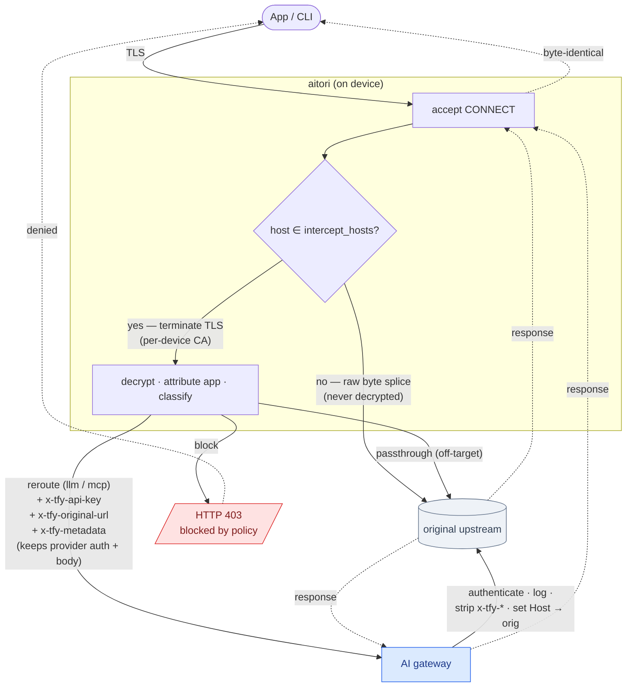

# Architecture

This document describes how aitori works internally. For the configuration
surface see [configuration.md](configuration.md); for the gateway side of the
contract see [gateway.md](gateway.md); for repository layout and the behaviour the
tests guarantee see [AGENTS.md](../AGENTS.md).

## The idea

aitori runs as the machine's HTTP(S) proxy, so the traffic an application sends
passes through it. For the hosts you list, aitori terminates TLS using a
certificate authority that exists only on that device, reads the request, and
decides whether it is a model or MCP call. If it is, aitori redirects the
upstream TCP connection to your gateway; the request the client built is otherwise
left as it is, and the client still sees the original host behind a certificate it
trusts. Requests to any other host, and requests on a listed host that are not
model or MCP calls, are forwarded to their real destination. Responses are
streamed back without buffering.

## Components

aitori is a single Go module (`github.com/truefoundry/aitori`). Each package
under `internal/` handles one concern:

| Package | Responsibility |
|---|---|
| `config` | schema, load/validate, defaults, managed overlay (strict: unknown keys rejected) |
| `hostmatch` | host-pattern matcher (exact, `*.x`, `.suffix`) |
| `token` | token-file reader + fsnotify watcher + in-memory cache |
| `ca` | per-device CA + on-the-fly leaf certs |
| `classify` | rules engine + body heuristics → `llm` \| `mcp` \| `other` |
| `circuit` | gateway circuit breaker (drives fail-open) |
| `router` | the reroute rewriter: adds the `x-tfy-*` headers, redirects the dial |
| `appresolve` | flow → app attribution (bundle / exe / process / host) |
| `pipeline` | resolve → classify → action (reroute \| passthrough) |
| `proxy` | selective-MITM server, splice, streaming forward, fail-open |
| `adapter` | OS interface + build-tagged impls (darwin/linux/windows) |
| `clientcfg` | patches client config (e.g. Claude Code `settings.json`) on up/down |
| `sysuser` | `SUDO_USER`-aware home/uid resolution (single source of truth) |
| `inject` / `sink` / `capture` | Tier-0 injectors, observability sinks, exchange records |
| `profiles` | embedded built-in app profiles (`//go:embed`) |

The mock gateway in `tools/aitori-gateway` is a separate Go module. It stands in
for a real gateway during testing and records each call to SQLite with a trace UI.
Keeping it separate means its OpenTelemetry and SQLite dependencies never reach the
agent, which stays small. The proxy itself is built on the standard library
(`crypto/tls`, `crypto/x509`, `net/http`) rather than a MITM framework, because the
parts that have to be exactly right are easier to control directly: deciding what
to decrypt, streaming responses verbatim, redirecting the dial, and failing open.

## Request lifecycle



If the gateway connection fails, times out, or the circuit breaker is open,
aitori skips the reroute and sends the request to its original destination
instead. This is the fail-open default, and it records a governance-gap event. It
can be changed to fail-closed.

### Selective MITM

aitori decides whether to decrypt a request from its host, before terminating
TLS. How it learns the host depends on how the traffic arrived. With a system or
explicit proxy (Tier 1) the host is in the client's `CONNECT` request. With
transparent capture (Tier 2) there is no `CONNECT`, so aitori reads the server
name from the TLS ClientHello. If the host is on the allowlist, aitori terminates
TLS with a leaf certificate it mints from the per-device CA; otherwise it copies
the bytes back and forth with `io.Copy` and never decrypts them. Leaving
everything else untouched keeps unrelated traffic private and avoids breaking
hosts that pin their certificates.

### Per-request action

Once a listed host is decrypted, aitori picks one action for the request, from a
matching rule, the host's default, or the body heuristic:

- **reroute** — the request is a model or MCP call, so it goes through the gateway.
- **passthrough** — the request was decrypted but is not a target call (for
  example, telemetry sent to the same host). aitori forwards it to the original
  upstream unchanged, with no gateway token attached.
- **block** — aitori returns HTTP 403 (`aitori: blocked by policy`) and does not
  forward the request. Like reroute, it can be scoped by host, path, and method.

A non-listed host is never decrypted in the first place.

Blocking is decided per request, from the rule that matched. There is no
per-application allow/block policy yet, and a host that pins its certificate still
fails open rather than being blocked (see [roadmap.md](roadmap.md)).

The categories are `llm`, `mcp`, and `other`, and only `llm` and `mcp` reroute by
default. The classifier first matches host, path, method, and body against the
configured rules. If nothing matches, it falls back to a heuristic: a JSON body
with `model` and one of `messages`, `input`, or `prompt` is `llm`; a JSON-RPC 2.0
body (`jsonrpc: "2.0"` with a `method`) is `mcp`; everything else is `other`.

## The gateway leg: a lean three-header contract

For a rerouted request, the URL and Host the client sees do not change; only the
upstream TCP connection is redirected to the gateway, over ordinary verified TLS
with no interception on that leg. The original request is sent as the client built
it, including its method, path, query, body, and the application's own headers
such as `Authorization`, `x-api-key`, and `Cookie`. aitori adds three headers,
plus any static headers from `gateway.headers`:

| Header | Config name | Carries |
|---|---|---|
| `x-tfy-api-key` | `gateway.header_token` | the gateway token (identity) |
| `x-tfy-original-url` | `gateway.header_orig_url` | the full original absolute URL |
| `x-tfy-metadata` | `gateway.header_ctx` | attribution JSON (see below) |

There is a reason to keep this to three headers: some gateways reject a large
header set with a 431 Request Header Fields Too Large. So the per-request
attribution travels inside one JSON header rather than one header per field. The
values in `x-tfy-metadata` are all strings, each truncated to 128 characters:

```json
{"app": "...", "pid": "...", "category": "llm",
 "host": "...", "os": "...", "agent_version": "..."}
```

The gateway authenticates the token, logs the call, removes every `x-tfy-*`
header, sets `Host` back to the original, and forwards the request to the URL in
`x-tfy-original-url` with the application's own credentials still attached. The
provider therefore authenticates the user with the user's own credential, and the
gateway token never reaches it. Earlier versions sent a separate header for each
attribute (`x-tfy-app`, `x-tfy-category`, and so on); those have been folded into
`x-tfy-metadata`.

## Attribution

aitori attributes each decrypted request to an application. Browser traffic is
identified by host. Desktop and command-line applications are identified by the
process behind the connection, which aitori resolves through the OS adapter: a
bundle id on macOS, and an executable path or process name elsewhere. The
socket-to-PID lookup can be slow, so aitori does it once per connection rather
than once per request; `http.Server` calls a per-connection hook before the first
request, which is where this happens. On Linux the PID comes from `/proc`. On
Windows the lookup is not available, because gopsutil cannot enumerate TCP
connections there, so aitori falls back to identifying the application by host.

## Capture tiers

A "tier" is the mechanism by which an application's traffic reaches the proxy. It
is not a configuration setting; you choose a tier by the command you run and a
couple of flags, and nothing selects one automatically.

- **Tier 1, system proxy with selective MITM**, is the default. `aitori up` sets
  the operating system's HTTP(S) proxy, so every application that honours it sends
  traffic through aitori, which decrypts the listed hosts and adds the `x-tfy-*`
  headers inline. `aitori run` does the same interception without changing any OS
  setting; you point a client at the proxy yourself. Enabled by `up` or `run`,
  reverted by `down` or Ctrl-C.
- **Tier 2, transparent capture**, is Linux-only and experimental. For
  applications that ignore the system proxy, aitori installs an nftables redirect
  and injects the same headers inline. Enabled by `proxy.transparent: true` (or
  `--transparent`) together with `up` on Linux, reverted by removing it or running
  `down`.
- **Tier 0, settings injection**, is for clients that both ignore the system proxy
  and ship their own CA bundle, such as Claude Code. aitori writes `HTTPS_PROXY`
  and a CA-trust variable into the application's managed or user `settings.json`,
  so a new session routes through the Tier-1 proxy and trusts the CA. Enabled by an
  `inject:` entry applied on `up`, reverted by `down`. This is the only Tier-0
  mechanism; aitori does not rewrite an application's model base URL, and pointing
  an application directly at a gateway URL is done through MDM, outside aitori.

| Tier | Mechanism | Enable | Disable |
|---|---|---|---|
| 1 (system proxy) | OS proxy + MITM | `aitori up` | `down` / Ctrl-C |
| 1 (manual) | MITM, no OS change | `aitori run` | Ctrl-C |
| 2 (transparent) | nftables redirect (Linux) | `proxy.transparent: true` + `up` | omit / `down` |
| 0 (settings inject) | patch app settings env | `inject:` entry on `up` | `down` |

## OS adapters

Everything specific to an operating system lives behind the `Adapter` interface,
in `adapter_<goos>.go`; the rest of the code compiles on all three platforms.

| Capability | macOS | Linux | Windows |
|---|---|---|---|
| CA install | `security add-trusted-cert` (System keychain) | `update-ca-certificates` + NSS `certutil` (Chrome/Firefox) | `certutil -addstore Root` (LocalMachine) |
| System proxy | `networksetup -setsecurewebproxy` | `gsettings` (GNOME), best-effort | WinINET registry + `InternetSetOption` |
| Transparent (Tier 2) | not implemented (needs a signed NE sidecar) | nftables `REDIRECT` + `SO_ORIGINAL_DST` (experimental) | not implemented (needs a WFP callout) |
| PID attribution | gopsutil (+ bundle id) | gopsutil (`/proc`, no cgo) | host-based (gopsutil can't enumerate conns) |
| CA key storage | `0600` file in `ca_dir` | `0600` file in `ca_dir` | `0600` file in `ca_dir` |

## Lifecycle and fail-safety

aitori runs in the foreground, under an operating-system supervisor. It responds
to two groups of signals:

- SIGINT, SIGTERM, and SIGHUP cause a graceful shutdown: aitori drains in-flight
  requests, up to `proxy.drain_timeout`, and then reverts the OS state it changed.
  Reverting matters because the system proxy points applications at aitori's
  listener, so a proxy left in place after aitori has stopped would break all
  traffic, which is worse than running with no governance at all. SIGHUP is treated
  as a shutdown so that closing the controlling terminal reverts the proxy cleanly.
- SIGUSR1, on Unix, reloads the governance configuration (the intercept set, rules,
  gateway, and pipeline) and swaps it in without dropping connections. The listener
  and the OS state are left as they are. On Windows there is no signal reload, so a
  restart is needed to pick up configuration changes.

On stop, aitori always clears the system proxy, but it leaves the CA installed;
only `aitori ca remove` deletes it. A `kill -9` cannot run the revert code, so
aitori should be deployed under a supervisor that runs `aitori down` when it
stops. At startup, aitori first reverts anything left behind by an earlier unclean
exit, before applying the current configuration, so state does not accumulate
across restarts.

## Coverage limits

- **stdio MCP** does not cross the network, so a proxy cannot see it; only remote
  MCP over SSE or streamable HTTP is captured.
- **Certificate-pinned applications** cannot be intercepted. If such an application
  offers a base-URL or proxy setting you can use Tier 0; otherwise aitori cannot
  cover it.
- **Backend-proxied applications** such as claude.ai and chatgpt.com send the
  metered model call from their own servers. aitori can govern the call to that
  backend, but not the model call itself.
- **HTTP/3 and QUIC** run over UDP, which a TCP proxy never sees.

Where this document and any older notes disagree (for example, the early
per-attribute `x-tfy-*` headers or a `capture_mode` setting), this document and the
code are correct.
