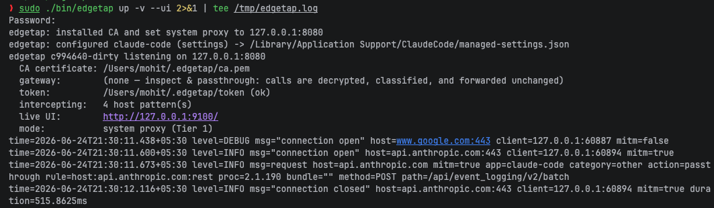
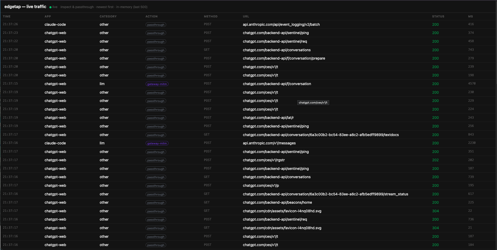

# Getting started

Install aitori, watch your AI traffic live, then point it at a real gateway to
govern that traffic. Building from source and the contributor walkthrough live in
[development.md](development.md).

## 1. Install

macOS and Linux:

```bash
curl -fsSL https://raw.githubusercontent.com/truefoundry/aitori/main/install.sh | sh
```

This downloads the release tarball for your OS/arch, verifies its checksum, and
installs `aitori` and `aitori-gateway`. The install location is `~/.local/bin`
when it's already on your `PATH` (a no-sudo install); otherwise `/usr/local/bin`
(always on `PATH`, but root-owned, so you'll be prompted for `sudo`). Set
`AITORI_INSTALL_DIR` to force a location, or `VERSION=vX.Y.Z` to pin a release.
The installer prints the exact paths it wrote and the uninstall steps when it
finishes.

> **macOS note:** binaries are unsigned. A `curl`-downloaded binary runs as-is.
> If you instead download the tarball in a browser, clear Gatekeeper quarantine
> first: `xattr -d com.apple.quarantine ./aitori`.

Windows isn't covered by the installer — grab the tarball from the
[Releases page](https://github.com/truefoundry/aitori/releases).

<details>
<summary><strong>Uninstall</strong></summary>

aitori changes system state beyond the binaries (a per-device CA in the trust
store, the system proxy, and edits to client configs like Claude Code's
`settings.json`). **Revert that first, while the binary still exists** — `down`
and `ca remove` *are* the uninstall logic, so deleting the binary first strands
those changes.

```bash
sudo aitori down          # revert the system proxy + undo client-config edits
sudo aitori ca remove     # remove the per-device CA from the system trust store

# then delete the binaries (use the path the installer printed):
rm -f /usr/local/bin/aitori /usr/local/bin/aitori-gateway   # or ~/.local/bin/...

# optional: drop the local state (CA private key, gateway token, trace DBs):
rm -rf ~/.aitori
```

There is no `aitori uninstall` command — the steps above are the supported path.
Upgrading, by contrast, needs none of this: just re-run the install command (it
overwrites the binaries in place); the CA is reused, so it doesn't need
reinstalling.

</details>

## 2. See your traffic (no gateway needed)

```bash
sudo aitori up --ui
```

`up` installs a per-device CA into the system trust store and points the system
proxy at aitori (that's why it needs `sudo`). The **built-in profiles** already
cover Claude (Code, Desktop, web) and ChatGPT, so their calls are decrypted and
classified out of the box. With **no gateway configured**, aitori runs in
*inspect & passthrough* mode: every intercepted call is logged, then forwarded
unchanged to its real upstream — nothing breaks.

`--ui` starts the embedded live view. Open it:

```
http://127.0.0.1:9100
```



Use Claude or ChatGPT, and the calls appear live (newest first), each tagged with
the app, category, action, and status:



When you're done, clean up:

```bash
sudo aitori down          # reverts the system proxy + undoes settings injection
```

`Ctrl-C` reverts everything on a clean exit, but **always run `sudo aitori down`
if the process was killed or the terminal was closed** — otherwise the system
proxy stays pointed at a stopped aitori and traffic breaks until it's cleared.
`down` is also safe to run any time as a "reset everything" (it reconciles state
left by an unclean exit). The per-device CA is intentionally left installed; remove
it with `sudo aitori ca remove`.

The UI address is configurable — `--ui-listen 127.0.0.1:9999`, or in a config:

```yaml
ui:
  enabled: true
  listen: 127.0.0.1:9100
```

`configs/demo.yaml` (shipped in the release) is exactly this. Run it with
`sudo aitori up -c demo.yaml`.

## 3. Govern the traffic — connect a gateway

Inspect & passthrough shows you what's happening; to actually **govern** (log,
budget, policy-check, reroute), point aitori at an AI gateway. Add a `gateway`
block (or pass `--gateway-url` / `--token-file`) and LLM/MCP calls reroute through
it instead of going straight upstream.

- **TrueFoundry AI Gateway** — where to copy the base URL + API key, and the
  required `tf-edge-proxy/` suffix: [truefoundry_gateway.md](truefoundry_gateway.md).
- **Any gateway** — the reroute contract a gateway must implement, and all the
  overrides: [gateway.md](gateway.md).

Want to try the reroute path locally first? The bundled `aitori-gateway` is a
mock gateway with its own trace UI — see [development.md](development.md).

## 4. Configure what's governed

Add your own hosts, scope which paths are traced, set policy, or disable the
built-ins entirely — all in YAML. See [configuration.md](configuration.md) for the
full reference, and [`configs/conversations.yaml`](../configs/conversations.yaml)
for a fully-commented example.

## Useful commands

- `aitori status` — capture tier, gateway health, token state, coverage.
- `aitori apps -c <file>` — list the governed app profiles.
- `aitori config validate <file>` — check a config without running.
- `aitori ca remove` — remove the device CA from the system trust store.
