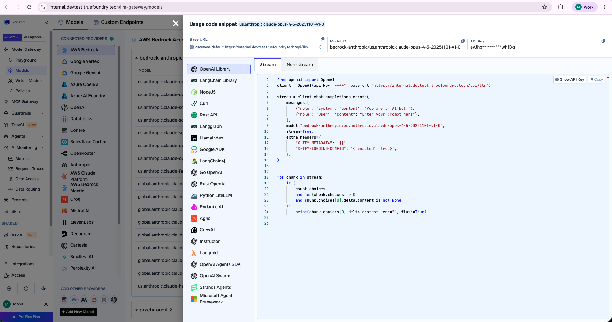

# Connecting aitori to the TrueFoundry AI Gateway

The same [`configs/conversations.yaml`](../configs/conversations.yaml) works
against a real TrueFoundry AI Gateway — only the gateway URL and token change.
This guide shows where to get them and how to start aitori pointed at the
gateway.

## 1. Get the base URL and API key

In the TrueFoundry AI Gateway UI, copy the **base URL** and an **API key** (the
"Unified Code Snippet" / virtual-account view shows both):



The base URL looks like:

```
https://<host>/api/llm
```

## 2. Append `ai-proxy/` to the URL

> **Required.** aitori must target the gateway's edge-proxy route, not the bare
> base URL. Take the base URL from the UI and **append `ai-proxy/`** (keep
> the trailing slash):
>
> ```
> https://<host>/api/llm/ai-proxy/
> ```
>
> This `…/api/llm/ai-proxy/` value is what you pass to aitori as the
> gateway URL.

## 3. Save the token on the device

Write the API key to a file aitori reads (the bare token; surrounding
whitespace is trimmed). `chmod 600` keeps the credential readable only by you:

```bash
mkdir -p ~/.aitori
echo '<your-api-key>' > ~/.aitori/tf_token
chmod 600 ~/.aitori/tf_token
```

## 4. Start aitori against the gateway

Point aitori at the gateway URL and token via flags (overriding the config), and
stop the local mock gateway if it's running:

```bash
sudo aitori up -v \
  --gateway-url "https://<host>/api/llm/ai-proxy/" \
  --token-file ~/.aitori/tf_token
```

Or set them directly in the config `config.yaml` instead of flags:

```yaml
gateway:
  url: https://<host>/api/llm/ai-proxy/    # base URL + ai-proxy/
  on_error: fail_open
  auth:
    token_file: ~/.aitori/tf_token
  headers:
    # Optional: some gateways read this to toggle request logging. The JSON value
    # is single-quoted so YAML keeps it a string, not a nested map.
    x-tfy-logging-config: '{"enabled": true}'
```

and run:

```bash
sudo aitori up -v \
  -c config.yaml --ui
```

## 5. Verify

```bash
aitori status \
  --gateway-url "https://<host>/api/llm/ai-proxy/" --token-file ~/.aitori/tf_token
#   gateway:   https://<host>/api/llm/ai-proxy/ [reachable]
#   token:     ~/.aitori/tf_token (ok)
```

Then exercise a governed app (e.g. Claude Code, or a `curl` through the proxy) and
confirm the calls appear in the TrueFoundry gateway's request logs. As always,
the app keeps its own provider credentials and gets byte-identical responses;
aitori only changes where the bytes go.
